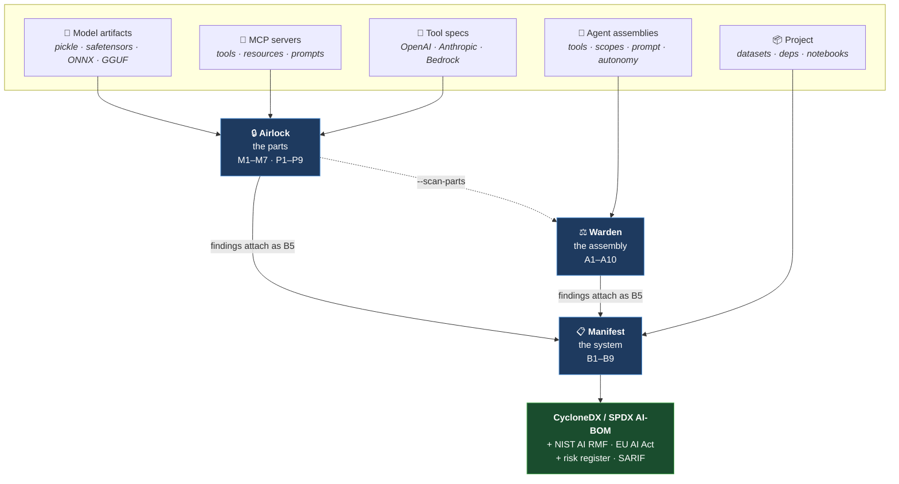
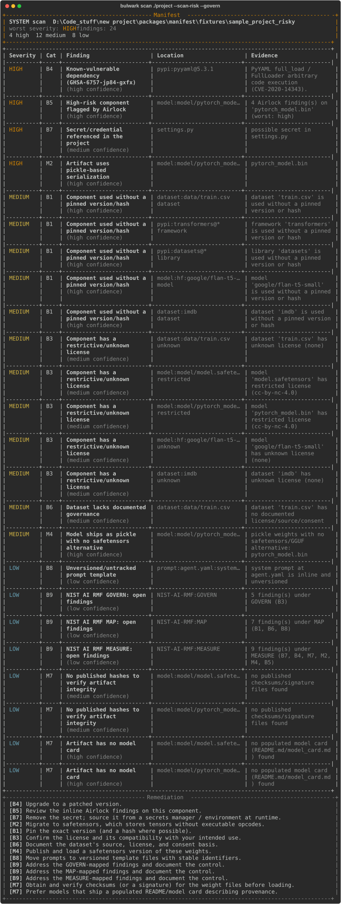

<div align="center">

# 🛡️ Bulwark

### The security stack for agentic AI

**Airlock scans the parts · Warden scans the assembly · Manifest inventories it all.**

*One engine, one taxonomy, one report format — three tools that audit the whole AI agent supply chain,
from the individual components up to the governable whole.*

`models` · `MCP servers` · `tool-specs` · `agent assemblies` · `datasets` · `prompts` · `dependencies`

[](https://github.com/mk12002/Bulwark/actions/workflows/ci.yml)
[](https://github.com/mk12002/Bulwark/actions/workflows/codeql.yml)
[](https://mk12002.github.io/Bulwark/)
[](LICENSE)
[](https://www.python.org/downloads/)


[](CONTRIBUTING.md)

**[Documentation](https://mk12002.github.io/Bulwark/)** ·
[Quick start](https://mk12002.github.io/Bulwark/quickstart/) ·
[Python API](https://mk12002.github.io/Bulwark/reference/api/) ·
[Examples](examples/) ·
[Threat model](SECURITY.md)

</div>

---

## The problem

A modern AI agent is assembled from third-party parts you didn't write and can't see inside — a
model off the Hub, an MCP server from a gist, a pile of tools wired into an autonomous loop, a
`requirements.txt` nobody audited. Each is a trust boundary. Almost nobody inspects them. And a system
built entirely from *individually benign* parts can still be dangerous because of **how they're wired
together**.

Bulwark is three composable scanners that answer the three questions you actually need answered:

| Tool | Scope | The question it answers | Status |
| --- | --- | --- | :---: |
| 🔒 **[Airlock](packages/airlock/)** | the **parts** | Is this model / MCP server / tool-spec itself malicious or unsafe? | ✅ v0.1 |
| ⚖️ **[Warden](packages/warden/)** | the **assembly** | Given how I wired the agent, does it have more power than its job needs? | ✅ v0.1 |
| 📋 **[Manifest](packages/manifest/)** | the **whole system** | What is my AI system made of, and is it governable? | ✅ v0.1 |

And they **compose — literally**. `manifest scan --scan-risk` builds an inventory of your project, then
calls Airlock on each model/MCP component and Warden on each agent assembly, and folds their findings
inline into one **CycloneDX AI-BOM** with a governance report. The suite's thesis, made real in one
command.



Every scanner runs the **same seven-stage pipeline** — only the first two stages differ:

```
resolve → analyze (signals) → rules → ScanResult → [AI] → postprocess → render → exit code
```

Detection lives in **YAML rule packs**, not code. Evidence gathering lives in typed
Python. That split is why a new detection can ship as a YAML-only pull request.

## Install

```bash
pip install airlock            # scan the parts
pip install warden             # scan the assembly
pip install "manifest[risk]"   # inventory the system, with risk folded in
pip install bulwark            # all three behind one front door
```

Each tool is independently installable — someone who wants a model scanner shouldn't
inherit an SBOM generator. Heavy dependencies sit behind extras and are imported lazily.

<details>
<summary>From source</summary>

```bash
git clone https://github.com/mk12002/Bulwark && cd Bulwark
python -m venv .venv && . .venv/Scripts/activate   # bin/activate on macOS/Linux
pip install -r requirements.txt
python check.py                                     # ruff + mypy + pytest, all 5 packages
```
</details>

## Try it (60 seconds)

```bash
# One front door over all three tools:
bulwark  scan ./project                              # inventory + Airlock/Warden risk + governance, in one shot
bulwark  airlock scan model hf:org/name              # or drive each tool directly ↓

airlock  scan model    hf:org/name@rev              # a HuggingFace model, pinned to an immutable revision
airlock  scan mcp      "python server.py"            # a live MCP server over stdio (or an sse/http URL)
airlock  scan toolspec tools.json                    # OpenAI / Anthropic / LangChain tool definitions

warden   audit agent.yaml --recommend                # audit an agent + rewrite it to least-privilege
warden   audit agent.yaml --profile permissive       # blockers-only posture (strict|balanced|permissive)
warden   import langchain_agent.py                    # normalize a LangChain / CrewAI / Assistants config

manifest scan ./project --format cyclonedx           # a standards-based ML-BOM of a whole project
manifest scan ./project --scan-risk --govern         # + Airlock/Warden risk inline + NIST AI RMF + EU AI Act
```

Every tool is **deterministic-first** (fully useful with zero AI), **CI-friendly** (`--fail-on`
exit codes + SARIF for GitHub code scanning), and **defensive-only**: it *detects and reports*, never
executes or imports the artifacts it scans, and every test fixture uses benign, inert markers.

<div align="center">

*`bulwark scan ./project --scan-risk --govern` — the whole suite in one command (real output):*



</div>

## What's inside

<table>
<tr><td valign="top" width="33%">

**🔒 Airlock** — the parts
- **M1–M7** model risks: pickle RCE (static opcode disasm), unsafe formats, `trust_remote_code`, archive smuggling + zip-bombs, provenance & hash verification
- **P1–P9** MCP risks: tool poisoning, hidden unicode, over-permissioned tools, cross-tool exfil graph, secrets, rug-pull, transport, shadowing
- formats: pickle · safetensors · GGUF · **ONNX** · **Keras** · **numpy** · **TF SavedModel** · **Flax** · compressed/nested
- **tool-spec** scanning (OpenAI/Anthropic/Bedrock/LangChain)

</td><td valign="top" width="33%">

**⚖️ Warden** — the assembly
- **A1–A10** excessive-agency: toxic tool combinations (source→sink graph), missing human gates, unsandboxed exec, open egress, runaway loops…
- a transparent **agency score (0–100)**
- importers: manifest YAML · MCP config · **OpenAI Assistants** · **LangChain/LangGraph** · **CrewAI**
- **least-privilege recommendation**: rewrites an over-privileged agent + shows a before/after diff
- `--scan-parts` runs Airlock on the MCP servers it wires

</td><td valign="top" width="33%">

**📋 Manifest** — the system
- discovers **models · datasets · MCP servers · prompts · tools · deps · notebooks**
- **CycloneDX** *and* **SPDX** AI-BOM output
- **B1–B9** governance: unpinned, provenance, license, OSV vulns, secrets, dataset gaps…
- risk **bridges** to Airlock + Warden (B5)
- **NIST AI RMF** *and* **EU AI Act** control mapping + risk register
- **BOM drift** (`manifest diff`) between versions

</td></tr>
</table>

Every finding is explainable — *what* was found, *where*, *why it matters*, a *severity*, a
*remediation*, and a *reference* (OWASP LLM Top 10 / MITRE ATLAS / CWE / NIST AI RMF).

## Architecture

```
bulwark/                      · uv-workspace monorepo
  packages/
    bulwark-core/             · the shared spine — Finding/Severity model, YAML rule engine,
                              ·   report renderers (terminal/JSON/HTML/SARIF), optional AI layer
    airlock/    depends on ──▶ bulwark-core
    warden/     depends on ──▶ bulwark-core   (+ airlock, optionally, for --scan-parts)
    manifest/   depends on ──▶ bulwark-core, airlock, warden
    bulwark/    depends on ──▶ all of the above · the `bulwark` meta-CLI (one front door)
```

Run the whole quality gate with one command — `python check.py` (ruff + mypy + pytest across every
package, each with its own config) — or `nox`.

Detection lives in **YAML rule packs**, not hardcoded — the community can extend any tool with a PR
(`<tool> rules update`). The optional AI layer (local Ollama by default, BYO OpenAI/Anthropic) is
**off by default**, capped, keys-from-env-only, and never overrides a deterministic finding. See
**[BULWARK.md](BULWARK.md)** for the full design and the shared-core contract.

## Python API

Everything the CLI does is available as a library. The rule engine is **injected**, not
constructed inside a scanner — so you can layer your own rule packs, or hand a scanner a
two-rule engine in a test.

```python
from airlock.rules import RuleEngine, load_rules
from airlock.scanners.model import ModelScanner
from bulwark_core.severity import Severity

result = ModelScanner(RuleEngine(load_rules())).scan("hf:org/name@revision")

for f in result.sorted_findings():
    print(f.severity.value, f.category, f.id, f.location.path)

raise SystemExit(result.exit_code(Severity.HIGH))    # the CI contract
```

Audit an agent **without touching the filesystem** — score a design before you build it:

```python
from warden.scanner import WardenScanner
from warden.spec.model import AgentSpec, Gate, Tool

spec = AgentSpec(name="bot", autonomy="autonomous", tools=[
    Tool(name="get_secret",   description="Read a credential from the vault"),
    Tool(name="post_webhook", description="POST data to a URL"),
    Tool(name="browse_web",   description="Visit a URL and return the page"),
])
result = WardenScanner(engine).audit_spec(spec)
print(result.score)     # 57/100 — and a CRITICAL A2: the lethal trifecta
```

Layer your own detections without writing Python:

```python
engine = RuleEngine(load_rules(extra_roots=[Path("./my-rules")]))
```

Full reference: **[Python API](https://mk12002.github.io/Bulwark/reference/api/)** ·
runnable scripts in **[`examples/`](examples/)** (exercised by CI, so they can't rot).

## Documentation

- **[docs/USAGE.md](docs/USAGE.md)** — the practical end-to-end guide: install, every command, output
  formats, CI, config, and how the tools compose.
- **[docs/LANDSCAPE.md](docs/LANDSCAPE.md)** — competitive & research landscape: existing tools,
  platforms, and academic work, and where Bulwark fits.
- **[docs/EMPIRICAL_VALIDATION.md](docs/EMPIRICAL_VALIDATION.md)** — corpus study, adversarial suite,
  and the picklescan benchmark.
- **[docs/DATASETS_AND_TESTING.md](docs/DATASETS_AND_TESTING.md)** — full reference for the external
  datasets (19-model corpus, adversarial corpus, config samples) and every test run on them.
- **[BULWARK.md](BULWARK.md)** + `docs/PROJECT_REFERENCE_*.md` — design contract and per-tool deep dives.

## Why it's credible

- **Standards-based** — CycloneDX ML-BOM + SPDX, SARIF for code scanning, OWASP LLM Top 10 / MITRE
  ATLAS / CWE / NIST AI RMF / EU AI Act references throughout.
- **Measured, not asserted** — validated on **19 real public HuggingFace models** (100% had a
  supply-chain finding; 95% ship pickle weights), a **14-payload adversarial suite** Airlock catches
  **14/14**, and a four-way **benchmark vs. picklescan / modelscan / fickling** (Airlock is the only one
  at 14/14 on evasive payloads; all four post 0/18 false alarms on benign models). Detectors target the
  2025 bypass wave directly — format/extension confusion (CVE-2025-10155 class) and a Fickling-style
  import allowlist. Full methodology: [`docs/EMPIRICAL_VALIDATION.md`](docs/EMPIRICAL_VALIDATION.md).
- **Reproducible research angle** — each tool ships a corpus/study harness for an empirical measurement
  of AI-supply-chain hygiene ("we scanned N public artifacts and X% were vulnerable").
- **Hardened against its own inputs** — a scanner that ingests hostile files must not become the
  attack. Bulwark inspects **statically** (never `pickle.load`/`torch.load`/imports repo code), caps
  every parse (opcode/size/member/decompression-bomb limits, bounded reads), contains symlinks and
  caps files when walking a target tree, bounds MCP connection time, rejects zip-slip in the rule
  feed, bounds regex input to blunt ReDoS, and HTML-escapes all report output (no scanner-report
  XSS). Two invariants are enforced by tests rather than discipline: core imports nothing from the
  tools, and core never calls an execution primitive. See [`SECURITY.md`](SECURITY.md).
- **Green everywhere** — 5 packages, 270+ tests, ruff + mypy + pytest all passing via one command
  (`python check.py`), matrixed in CI. Releases are ordered (core first), **Sigstore-signed**, and
  ship Bulwark's own AI-BOM as an artifact — the project applies its own advice to itself.

## Roadmap

1. ✅ **Airlock** — models · MCP · tool-specs, 42 rules, hardened + anti-evasion parsers, SARIF/CI, optional AI.
2. ✅ **`bulwark-core`** extracted; **Warden** — least-privilege audit, capability graph, agency score, framework importers, `--scan-parts`, policy profiles.
3. ✅ **Manifest** — CycloneDX + SPDX AI-BOM, OSV vulns, B1–B9, Airlock/Warden bridges, NIST AI RMF + EU AI Act, BOM diff.
4. ✅ **`bulwark` meta-CLI** + empirical validation (real-model corpus study, adversarial suite, picklescan benchmark) + matrixed CI.
5. ⏭️ PyPI publishing · a larger cross-tool corpus study · a hosted BOM dashboard.

<div align="center">
<sub>Bulwark is a defensive security project. It detects and reports risk; it never weaponizes.
Fixtures are benign and inert by design.</sub>
</div>
