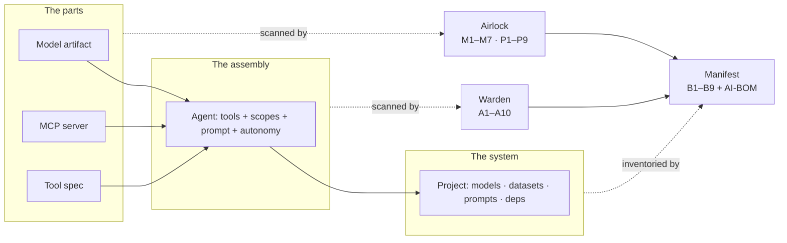

# Bulwark

**The security stack for agentic AI.** Three composable scanners that audit the whole
AI agent supply chain — from individual components up to the governable whole.

<div class="grid cards" markdown>

- :material-package-variant-closed: **Airlock** — the *parts*
  Is this model, MCP server, or tool-spec itself malicious or unsafe?

- :material-graph-outline: **Warden** — the *assembly*
  Given how I wired the agent, does it hold more power than its job needs?

- :material-clipboard-list: **Manifest** — the *system*
  What is my AI system made of, and is it governable?

</div>

## The problem

A modern AI agent is assembled from third-party parts you did not write and cannot see
inside: a model off a public hub, an MCP server from a gist, a pile of tools wired into
an autonomous loop, a `requirements.txt` nobody audited.

Each is a trust boundary. Almost nobody inspects them. And a system built entirely from
*individually benign* parts can still be dangerous because of **how they are wired
together** — which no part-level scanner can see.



## Install

```bash
pip install airlock          # scan the parts
pip install warden           # scan the assembly
pip install "manifest[risk]" # inventory the system, with risk folded in
pip install bulwark          # all three behind one front door
```

## Sixty seconds

```bash
# The whole suite in one command
bulwark scan ./my-ai-project

# Or drive each layer directly
airlock  scan model    hf:org/name@revision
airlock  scan mcp      "python server.py"
warden   audit agent.yaml --recommend
manifest scan ./project --scan-risk --govern
```

## Why it is credible

!!! success "Measured, not asserted"

    - **19 real public HuggingFace models** scanned — 100% had a supply-chain finding,
      100% published **no hashes** to verify integrity.
    - A **14-payload adversarial suite** of evasive-but-benign pickles: Airlock catches
      **14/14**, where picklescan gets 11, modelscan 9, fickling 9.
    - On **18 benign models** all four scanners report **0/18** false alarms. *That* is
      the number that matters — catching attacks is easy if you cry wolf.

    Full methodology: [Validation](validation.md).

## Design commitments

| | |
|---|---|
| **Deterministic-first** | Fully useful with zero AI. The optional AI layer never removes, downgrades, or gates a deterministic finding. |
| **Inspection only** | Never `pickle.load`, never `torch.load`, never imports scanned code, never invokes an MCP tool. Enforced by a test. |
| **Bounded** | Every parse has a named limit with an environment override — opcodes, archive members, compression ratio, files walked, connection time. |
| **Explainable** | Every finding states *what*, *where*, *why it matters*, *how bad*, *how to fix*, and *on what authority*. |
| **Standards-based** | CycloneDX + SPDX + VEX, SARIF for code scanning, OWASP LLM Top 10 / MITRE ATLAS / CWE / NIST AI RMF / EU AI Act references throughout. |

## Where to go next

- New here → [Quick start](quickstart.md)
- Adding it to a pipeline → [CI integration](guides/ci.md)
- Want to understand the design → [Architecture](architecture.md)
- Evaluating the security posture → [Threat model](threat-model.md)
