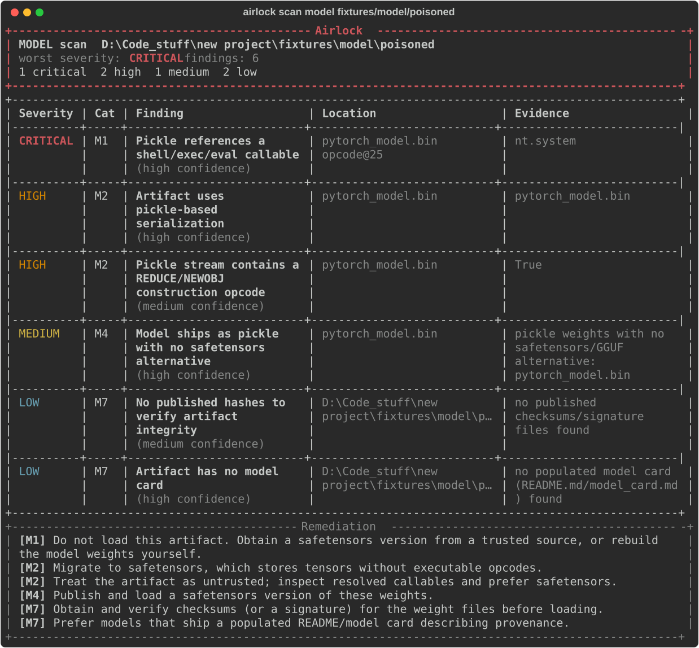

# 🔒 Airlock

**Static security scanner for the AI agent supply chain** — and the first tool in the
[Bulwark](../../README.md) suite (*Airlock scans the parts*). Audit the untrusted third-party code you
plug into an agentic system — **ML model artifacts**, **MCP servers**, and **agent tool-specs** —
*before* they run.

One engine, one risk taxonomy, one report format, three scan targets. Think `trivy`/`nikto`, but for
the agent-tooling and model-loading layer. It reads pickle opcodes, MCP tool metadata, and tool
schemas **statically** — it never loads a model, invokes a tool, or imports repo code. CLI-first,
deterministic-first; AI is an optional enrichment layer that is off by default.

**Formats it understands:** pickle (`.bin`/`.pt`/`.ckpt`/`.pkl`/joblib/dill) · safetensors · GGUF ·
ONNX · Keras (`.h5`/`.keras`) · numpy (`.npy`/`.npz` object arrays) · **TensorFlow SavedModel** ·
**Flax msgpack** · PMML · gzip/zlib-compressed and base64-nested pickles.



```bash
airlock scan model    ./path/to/model            # or hf:org/name  (pickle, safetensors, GGUF, ONNX, Keras, npy…)
airlock scan mcp      "python server.py"         # stdio command, or an sse/http URL
airlock scan toolspec tools.json                 # OpenAI / Anthropic / Bedrock / LangChain tool definitions
airlock study         corpus.txt                 # scan many targets → aggregate stats
airlock rules list                               # 42 rules; `rules update --from <feed>` to extend
```

## Why

Modern agents are assembled from third-party parts. **Model artifacts** decide *what the agent
knows*; **MCP servers** decide *what the agent can do*. Both are trust boundaries you download and
wire into a system that then acts semi-autonomously — and almost nobody inspects them first. Airlock
is the airlock: nothing enters the agent environment without being decompressed and inspected.

## What it catches

| Model artifacts (M) | MCP servers (P) |
| --- | --- |
| **M1** pickle code execution (CRITICAL) | **P1** tool poisoning |
| **M2** unsafe deserialization surface | **P2** injection via tool output |
| **M3** suspicious payload signatures | **P3** hidden / obfuscated content |
| **M4** risky serialization format | **P4** over-permissioned tools |
| **M5** remote/custom code via config | **P5** cross-tool exfiltration |
| **M6** archive smuggling | **P6** secret / credential leakage |
| **M7** provenance & integrity gaps | **P7** rug-pull / TOFU · **P8** transport/auth · **P9** shadowing |

Every finding states *what* was found, *where*, *why it matters*, a *severity*, a *remediation*, and
a *reference* (OWASP LLM Top 10 / MITRE ATLAS / CWE).

## See it in action

Benign, intentionally-vulnerable fixtures ship in-repo, so a fresh clone produces real findings on
the first run — no external downloads required.

**Scanning a poisoned model** (`airlock scan model fixtures/model/poisoned`):

```
┌──────────────────────────────── Airlock ─────────────────────────────────┐
│ MODEL scan  fixtures/model/poisoned                                       │
│ worst severity: CRITICAL    findings: 6                                   │
│ 1 critical  2 high  1 medium  2 low                                       │
└───────────────────────────────────────────────────────────────────────────┘
  CRITICAL  M1   Pickle references a shell/exec/eval callable    nt.system @ pytorch_model.bin
  HIGH      M2   Artifact uses pickle-based serialization        pytorch_model.bin
  HIGH      M2   Pickle stream contains a REDUCE/NEWOBJ opcode   pytorch_model.bin
  MEDIUM    M4   Model ships as pickle with no safetensors        pytorch_model.bin
  LOW       M7   Artifact has no model card
  LOW       M7   No published hashes to verify integrity
```

**Scanning a poisoned MCP server** (`airlock scan mcp "python fixtures/mcp/poisoned_server.py"`):

```
  HIGH   P1   Tool description contains agent-directed override instructions   run_shell
  HIGH   P1   Tool description references sensitive files or credentials       run_shell, read_user_file
  HIGH   P3   Tool metadata contains hidden or obfuscated unicode              summarize
  HIGH   P4   Tool exposes shell / command execution                          run_shell
  HIGH   P5   Reachable sensitive-source → network-sink path across tools     run_shell → upload_to_url
  MEDIUM P4   Tool exposes raw network egress / wildcard scope                upload_to_url, read_user_file
```

The matching clean fixtures (`fixtures/model/clean`, `fixtures/mcp/clean_server.py`) scan with **zero
findings** and exit `0`.

## Install

```bash
pip install -e ".[dev,model,mcp]"
```

## Output & CI

Pick a report format with `--format terminal|json|html|sarif`. The **SARIF** output plugs straight
into GitHub code scanning, and `--fail-on <severity>` exits non-zero when any finding is at or above
a threshold, so Airlock can gate a build:

```bash
airlock scan model hf:org/name --format sarif --fail-on high > airlock.sarif
```

### Noise control for real pipelines

- **Baseline diff** — `--baseline prev.json` reports only findings *absent* from a prior scan, so
  CI gates on **regressions**, not the pre-existing backlog:
  ```bash
  airlock scan model ./m --format json > baseline.json     # once, reviewed
  airlock scan model ./m --format json --baseline baseline.json   # exits 0 unless something NEW appears
  ```
- **Waivers** — suppress advisory noise (e.g. the M4/M7 advisories that fire on every pickle) by
  rule-id or path glob in `airlock.toml` (`suppress_rules` / `suppress_paths`). Suppressed counts are
  still reported for transparency.

### Hardening & anti-evasion

Airlock ingests hostile artifacts, so it defends itself: archive inspection caps member count and
flags **decompression bombs** (extreme size/ratio), pickle disassembly is **opcode-capped and
streamed** (never loading a multi-GB file into memory), and base64-encoded **nested pickles** are
decoded one level deep to catch staged payloads. All limits are tunable via `AIRLOCK_LIMIT_*`.

Two detectors target the 2025 scanner-bypass wave head-on:

- **Format/extension confusion (M6)** — Airlock sniffs magic bytes, so a pickle renamed
  `model.safetensors` to dodge an extension-based classifier (the picklescan **CVE-2025-10155** bypass
  class) is flagged *and* disassembled anyway. Zero false positives on genuine safe-format files.
- **Allowlist mode (`--strict`, M3)** — Fickling-style: instead of only blocking known-bad imports, it
  surfaces any pickle import from a module *outside* the ML allowlist (torch/numpy/collections/…),
  catching novel callables a denylist has never seen.

### Proven, not just claimed

Airlock is validated on real data and against a real competitor — see
[`docs/EMPIRICAL_VALIDATION.md`](../../docs/EMPIRICAL_VALIDATION.md):

- **Corpus study** over **19 public HuggingFace models** — 100% had a supply-chain finding, 95% ship
  pickle weights, 89% contain a `REDUCE` opcode. (`python scripts/build_corpus.py` then `airlock study`.)
- **Adversarial suite** — 14 evasive-but-benign payloads (protocols 0–5, `STACK_GLOBAL`, gzip/zlib,
  base64-staged, `.npy`, torch-zip, format-spoofed `.safetensors`). Airlock flags **14/14**; locked in
  by `tests/test_adversarial.py`.
- **Benchmark vs. picklescan** (`scripts/benchmark.py`) — **14/14 vs 10/14** on evasive payloads (Airlock
  also decompresses + decodes one level), and **0/18 vs 0/18** false code-exec alarms on benign models.

### Corpus study & AI evaluation

`airlock study corpus.txt` scans a list of targets (one `kind target` per line) and produces a
reproducible aggregate report — prevalence, category/severity histograms, top rules, and the Airlock
+ rule versions — the engine behind a "we scanned N artifacts and X% had ≥1 finding" write-up. See
[`docs/STUDY_SAMPLE.md`](docs/STUDY_SAMPLE.md) for output over the bundled corpus. The AI semantic
detector has its own labeled eval (`python scripts/eval_ai.py`) reporting precision/recall/F1, so its
value is measured, not assumed.

### GitHub Action

A composite action ships in this repo ([`action.yml`](action.yml)). It installs Airlock, runs a
scan, writes a report, and gates on the threshold — pair it with `upload-sarif` for code scanning:

```yaml
- uses: airlock/airlock@v1
  with:
    scan-type: model               # or: mcp
    target: fixtures/model/poisoned # a path, hf:org/name, or an MCP command/URL
    format: sarif
    output: airlock.sarif
    fail-on: high
- uses: github/codeql-action/upload-sarif@v3
  if: always()
  with:
    sarif_file: airlock.sarif
```

See [`.github/workflows/airlock-scan.yml`](.github/workflows/airlock-scan.yml) for a complete,
build-gating example.

## Extensible by design

Detection logic lives in **YAML rule packs** under [`airlock/rules/`](airlock/rules), not hardcoded.
Contributions are a first-class feature — add a rule pack, ship a benign fixture and a test, open a
PR. The full rule format, signal catalog, and predicate reference are in
[`CONTRIBUTING.md`](CONTRIBUTING.md).

## AI enrichment (optional, off by default)

Airlock is fully useful with **zero AI configured** — every core finding is deterministic. The
optional AI layer only *enriches*: it adds a semantic second opinion (triage), can raise recall on
tool-poisoning descriptions the rules miss, and writes a short executive summary. It never replaces,
downgrades, or gates on a deterministic finding — AI output is tagged `source="ai"` / `ai_assessment`
and rendered as clearly-marked advisory content.

Two switches are required: `[ai].enabled = true` in config **and** the `--ai` flag. The default
provider is a **local Ollama** server (no key, no egress, no token cost); OpenAI-compatible and
Anthropic providers are also supported. API keys are read only from `AIRLOCK_AI_API_KEY`, never from
disk. See [`airlock.toml.example`](airlock.toml.example).

```bash
export AIRLOCK_AI_API_KEY=...          # only for openai_compat / anthropic
airlock scan mcp "python server.py" --ai --format json
```

If AI is unreachable or misconfigured, the scan degrades gracefully to deterministic-only output with
a warning — it never crashes or blocks.

## Safety

Airlock is a **defensive** tool. It *detects and reports* risks; it never executes the artifacts it
scans (no `pickle.load`, no `torch.load`, no importing repo code, no invoking MCP tools). Test
fixtures that simulate malicious artifacts use **benign, inert markers** only.

See [`docs/PROJECT_REFERENCE_AIRLOCK.md`](../../docs/PROJECT_REFERENCE_AIRLOCK.md) for the full
design, and the repo-root [`README`](../../README.md) / [`BULWARK.md`](../../BULWARK.md) for how
Airlock fits into the Bulwark suite.
